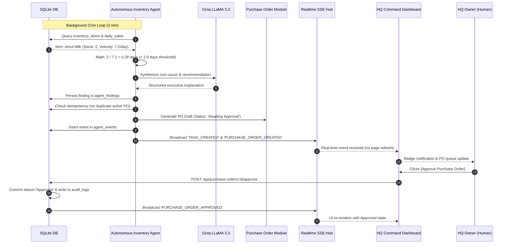

# KhataCopilot HQ — Autonomous Multi-Agent Retail Operations Platform

<div align="center">


[](https://www.typescriptlang.org/)
[](https://react.dev/)
[](https://nodejs.org/)
[](https://expressjs.com/)
[](https://www.sqlite.org/)
[](https://groq.com/)
[](#-autonomous-ai-agents)
[](#-testing--validation)

**An enterprise-grade, real-time, authenticated, multi-agent retail operating network.**  
*Bridging corporate headquarters, regional directors, franchise owners, and store managers through autonomous backend AI agents and Apple-inspired Human Interface Guidelines (HIG).*

</div>

---

## 📌 Executive Overview

KhataCopilot HQ transforms traditional retail operations into an **autonomous, self-governing retail network**. 

Instead of store managers and executives manually reviewing thousands of spreadsheets and registers, **8 server-side autonomous AI agents** continuously scan real normalized database records, detect stockouts and cash variances, calculate risk velocity, draft purchase orders, cascade operational events, and present actionable findings for human-in-the-loop approval.

---

## 🏗️ System Architecture

```
                                  [ Authenticated Client (Vite + React) ]
                                            │                 │
                                    REST API (Bearer JWT)   Server-Sent Events (SSE)
                                            │                 │
                                            ▼                 ▼
                          ┌─────────────────────────────────────────────────┐
                          │         Express Server & RBAC Middleware        │
                          │  - Role-based territorial scoping & 403 guards  │
                          │  - Realtime SSE Hub with subscriber scoping     │
                          └──────────────────────┬──────────────────────────┘
                                                 │
                   ┌─────────────────────────────┼─────────────────────────────┐
                   ▼                             ▼                             ▼
       ┌────────────────────────┐   ┌─────────────────────────┐   ┌─────────────────────────┐
       │ Normalized SQLite DB   │   │  Multi-Agent Engine     │   │ Groq AI Reasoning Layer │
       │ 23 Normalized Tables   │   │  8 Server-Side Agents   │   │ Server-side only        │
       │ (WAL Mode, Constraints)│   │  Background Scheduler   │   │ Issue Classification    │
       └────────────────────────┘   │  Event Bus & Cascades   │   │ Bug Similarity Analysis │
                                    └─────────────────────────┘   └─────────────────────────┘
```

### Core Architectural Principles
1. **Mathematical Determinism First:** All financial sums, stock velocity, debt aging, and health scores are computed with 100% precision by deterministic backend code.
2. **AI for Reasoning & Triage:** Groq LLaMA models are utilized solely for root-cause synthesis, operational explanations, support ticket classification, and known issue bug matching.
3. **True Browser-Closed Autonomy:** Agents run on configurable background cron loops inside the Node.js runtime—they do not depend on an open browser window.
4. **Server-Enforced Scope:** Strict multi-tenant boundaries guarantee that a Store Manager or Area Manager cannot inspect unauthorized stores by modifying client state or API URLs.

---

## 🤖 The 8 Autonomous AI Retail Agents

Each agent operates within its own dedicated workspace shell with live findings, mathematical evidence, task history, and run telemetry:

| Agent | Workspace Route | Cadence / Trigger | Mathematical Logic / Primary Function | Action Generated |
| :--- | :--- | :--- | :--- | :--- |
| **1. Sales Intelligence** | `/agents/sales` | Every 10 min + On-Demand | Detects category margin compression ($<10\%$) vs $14\%$ target baseline. | Gross margin optimization directive |
| **2. Inventory Agent** | `/agents/inventory` | Every 3 min + On-Demand | $\text{Runway Days} = \frac{\text{Current Stock}}{\text{Sales Velocity}}$. Alerts if $\le 2.0\text{ days}$. | **Automated Purchase Order Draft** (`PO-2026-INV-...`) |
| **3. Udhaar Risk Agent** | `/agents/udhaar-risk` | Every 10 min + On-Demand | Identifies accounts overdue $>45\text{ days}$ with zero repayments. | Debt collection reminder dispatch & credit freeze |
| **4. Revenue Anomaly Agent**| `/agents/revenue-anomaly` | Every 5 min + On-Demand | Flags $>15\%$ drop between recent 7-day and previous 7-day moving averages. | Store audit & price-competitiveness review |
| **5. Cash Risk Agent** | `/agents/cash-risk` | Every 10 min + On-Demand | POS expected register cash vs. physical drawer count ($< -₹500$). | Till shortage investigation & cashier audit |
| **6. Shop Health Agent** | `/agents/shop-health` | Every 5 min + Cascaded | Multi-factor health index (0–100) aggregating margin, debt, till shortages, and stockouts. | Updates branch tier (`Healthy`, `Watch`, `At-Risk`) |
| **7. Retention Agent** | `/agents/retention` | Event-triggered + 10 min | Listens for `SHOP_HEALTH_DEGRADED` or health score $<60$. | **Field Manager Intervention Dispatch** |
| **8. Support / Community**| `/agents/support` | Event-driven (`POST_CREATED`)| Groq AI NLP triage matching symptoms to verified known issues (e.g. `BUG-1821`). | Auto-replies with verified workaround solution |

---

## 🔐 Role-Based Access Control (RBAC) & Scope Matrix

Authentication is enforced on the server via signed JSON Web Tokens (JWT) with bcrypt password hashing:

| Persona | Demo Email | Territory / Data Visibility | Permissions & Capabilities |
| :--- | :--- | :--- | :--- |
| **HQ Owner** | `hq.owner@demo.khatacopilot.com` | **Global Enterprise**: All 15 stores, all territories (West, North, South). | Full administrative control, agent execution, PO approvals, GST reports, company settings. |
| **HQ IT Support** | `hq.it@demo.khatacopilot.com` | **Technical Operations**: Read-only branch inspection, full support network. | Technical community triage, known bug directory, agent observability, diagnostics. |
| **Area Manager** | `area.manager@demo.khatacopilot.com` | **West Region (Maharashtra)**: Only Pune, Mumbai, Nashik, Thane, Nagpur (10 stores). | Regional KPI monitoring, local agent execution, field staff dispatch. |
| **Franchise Owner** | `franchise.owner@demo.khatacopilot.com` | **Patel Retail Network**: Only assigned franchise stores (3 stores). | Franchise profitability, inventory health, store manager oversight. |
| **Store Manager** | `store.manager@demo.khatacopilot.com` | **Single Counter**: Exclusively Sharma General Store (`shop-01`). | Local till reconciliation, stock alerts, local Khata credit book. |

> **Universal Demo Password:** `DemoPass2026!`  
> *(The login screen features a 1-click persona quick-picker to switch roles instantly for evaluation).*

---

## ⚡ End-to-End Operational Lifecycle



---

## 🛠️ Technology Stack

| Layer | Technologies Used |
| :--- | :--- |
| **Frontend UI** | React 19, TypeScript, Vite 8, Lucide Icons, Custom Apple HIG Design Tokens |
| **Backend API** | Node.js, Express 5, TypeScript (`tsx` runner), RESTful endpoints |
| **Database & ORM** | SQLite 3 via `better-sqlite3` (WAL mode, Foreign Keys, Synchronous NORMAL) |
| **Realtime Stream** | Server-Sent Events (SSE) with authenticated territorial scope filters |
| **AI Reasoning Layer** | Groq SDK (`llama-3.3-70b-versatile`, `llama-3.1-8b-instant`), JSON mode schemas |
| **Authentication** | JWT (`jsonwebtoken`), `bcryptjs`, local storage session manager |
| **Testing** | Custom end-to-end integration suites (`test_e2e_full.ts`, `audit_verifier.ts`) |

---

## 🚀 Quick Start Guide

### Prerequisites
- **Node.js**: v18.0+ (Tested on Node.js v24.x)
- **npm**: v9.0+

### 1. Clone & Install
```bash
git clone https://github.com/ABHISHEK-DBZ/kc.git
cd kc
npm install
```

### 2. Environment Configuration
Copy `.env.example` to create your local `.env`:
```bash
cp .env.example .env
```
*(Optional: Provide a `GROQ_API_KEY=gsk_...` to enable live Groq cloud reasoning. If omitted, the platform seamlessly runs in resilient deterministic fallback mode).*

### 3. Seed Normalized Database
```bash
npm run seed
```
Creates `data/khatacopilot.db` populated with:
- 15 retail stores across Maharashtra, Delhi, and Bangalore
- 450+ transactional daily sales records (30-day history)
- Comprehensive inventory catalogs with burn rates
- Active Udhaar credit records across aging buckets
- 5 pre-configured demo user accounts

### 4. Start Development Server
```bash
npm run dev
```
Concurrently starts:
- **Express Backend Server:** `http://localhost:3001`
- **Vite Frontend Client:** `http://localhost:5173`

Open `http://localhost:5173` in your browser to begin.

---

## 🧪 Testing & Validation

The platform includes automated forensic verification suites:

### 1. Run Autonomous Multi-Agent Forensic Audit
```bash
npm run test:agents
```
Executes 9 forensic verification checks:
- Background scheduled runs verification (browser-closed proof)
- Data mutation & stockout runway threshold triggers
- False-positive alert suppression
- Idempotency & duplicate task prevention
- Single Run ID trace across 4 database tables
- Persistent event bus verification (`agent_events`)
- Production bundle security scan (zero secret leaks)
- Territorial scoping & 403 Forbidden enforcement
- Automatic failure recovery & retry queue

### 2. Run Full End-to-End Acceptance Suite
```bash
npm run test:e2e
```
Validates all 22 end-to-end integration flows (login, scoping, agent execution, PO approvals, bug similarity matching, GST draft reports, CSV streaming export, and audit trails).

### 3. Production Typecheck & Build
```bash
npm run build
```
Runs `tsc -b && vite build` ensuring complete TypeScript type safety and minification.

---

## 📂 Project Structure

```
kc/
├── data/                         # SQLite database storage (git-ignored)
├── server/
│   ├── db/
│   │   ├── database.ts           # SQLite connection with WAL mode
│   │   ├── schema.sql            # 23 normalized tables with foreign keys & indexes
│   │   └── seed.ts               # Deterministic seed data script
│   ├── middleware/
│   │   └── auth.ts               # JWT verification & resolveUserScope RBAC
│   ├── routes/
│   │   ├── agents.ts             # Agent run triggers, findings, tasks
│   │   ├── analytics.ts          # Overview KPIs & sales history
│   │   ├── auditLogs.ts          # Immutable audit trail
│   │   ├── auth.ts               # Login, logout, session verification
│   │   ├── community.ts          # Franchise community & issue resolution
│   │   ├── purchaseOrders.ts     # PO drafting, approvals, and rejections
│   │   ├── realtime.ts           # Server-Sent Events (/api/realtime)
│   │   ├── reports.ts            # GST draft & CSV export streaming
│   │   ├── search.ts             # Global scoped search
│   │   └── shops.ts              # Store catalog & CRM endpoints
│   ├── services/
│   │   ├── agentOrchestrator.ts  # Autonomous multi-agent scheduler & engine
│   │   ├── groqService.ts        # Isolated server-side Groq LLaMA integration
│   │   └── realtimeHub.ts        # Scoped SSE event distributor
│   └── index.ts                  # Express server entry point (Port 3001)
├── src/
│   ├── components/               # Header, Sidebar, Global Search, Modals
│   ├── services/
│   │   ├── api.ts                # Authenticated client API layer
│   │   └── realtime.ts           # Client-side SSE EventSource listener
│   ├── views/
│   │   ├── agents/               # 8 Dedicated Agent Workspaces
│   │   ├── community/            # Franchise Community & Issue Resolution
│   │   ├── LoginView.tsx         # Apple HIG login interface
│   │   ├── OverviewView.tsx      # Enterprise Command Center dashboard
│   │   ├── PurchaseOrdersView.tsx# Human-in-the-loop PO approval queue
│   │   └── ...                   # Shops, Sales, Udhaar, Inventory, Reports
│   ├── App.tsx                   # Central router & state coordinator
│   └── styles/apple-theme.css    # Apple HIG design tokens
├── audit_verifier.ts             # Forensic agent verification test suite
├── test_e2e_full.ts              # 22-step full acceptance test suite
└── vite.config.ts                # Reverse proxy configuration
```

---

## 🔒 Security & Compliance

- **No Client-Side Secrets:** `GROQ_API_KEY` is loaded exclusively inside the Node.js backend. Automated bundle scanning verifies zero API keys or secrets exist in frontend assets.
- **Regulatory GST Disclaimers:** All GST draft reports clearly state:  
  *`"DRAFT / DEMO — requires verification before filing."`*
- **Immutable Audit Trail:** All critical operations (`agent.started`, `agent.completed`, `po.approved`, `user.login`) write structured JSON records with actor details and timestamps to `audit_logs`.
- **Fail-Safe Idempotency:** Duplicate agent executions on identical unaddressed conditions will never generate duplicate purchase orders or redundant field notifications.

---

## 📄 License

This project is licensed under the [MIT License](LICENSE).

<div align="center">
<sub>Built with precision for enterprise retail operations. KhataCopilot HQ &copy; 2026.</sub>
</div>
